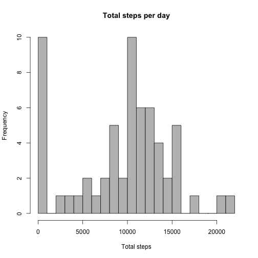
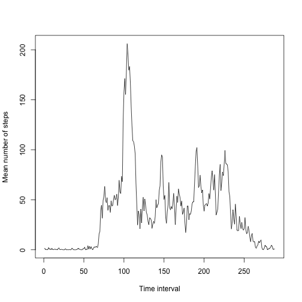
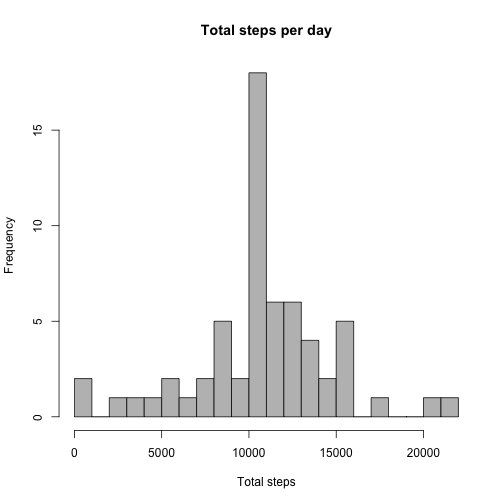
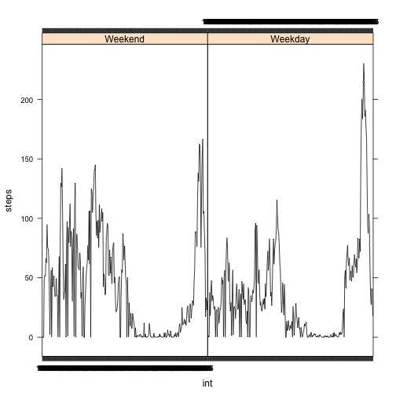

<h1>Peer Assessment 1<br/></h1>


<h2><tab>Introduction</h2> 


This assignment's objective is do some general data analysis
and to then create a tidy dataset. First we will load the data and get some summary statistics for the variables in the dataframe. **Note: You might want modify the setwd command**

<br>
<br>


```r
library(lattice)
library(plyr)
library(knitr)
setwd("/Users/arios/GitHub/Coursera/")
dat=read.csv("activity.csv")
summary(dat)
```

```
##      steps                date          interval     
##  Min.   :  0.00   2012-10-01:  288   Min.   :   0.0  
##  1st Qu.:  0.00   2012-10-02:  288   1st Qu.: 588.8  
##  Median :  0.00   2012-10-03:  288   Median :1177.5  
##  Mean   : 37.38   2012-10-04:  288   Mean   :1177.5  
##  3rd Qu.: 12.00   2012-10-05:  288   3rd Qu.:1766.2  
##  Max.   :806.00   2012-10-06:  288   Max.   :2355.0  
##  NA's   :2304     (Other)   :15840
```
<br/>
Then we will estimate total number of steps per day and display them. Thereafter we will create a histogram.
<br/>
<br/>

```r
table_steps=tapply(dat$steps,dat$date,sum,na.rm=T)
total=table_steps
total
```

```
## 2012-10-01 2012-10-02 2012-10-03 2012-10-04 2012-10-05 2012-10-06 
##          0        126      11352      12116      13294      15420 
## 2012-10-07 2012-10-08 2012-10-09 2012-10-10 2012-10-11 2012-10-12 
##      11015          0      12811       9900      10304      17382 
## 2012-10-13 2012-10-14 2012-10-15 2012-10-16 2012-10-17 2012-10-18 
##      12426      15098      10139      15084      13452      10056 
## 2012-10-19 2012-10-20 2012-10-21 2012-10-22 2012-10-23 2012-10-24 
##      11829      10395       8821      13460       8918       8355 
## 2012-10-25 2012-10-26 2012-10-27 2012-10-28 2012-10-29 2012-10-30 
##       2492       6778      10119      11458       5018       9819 
## 2012-10-31 2012-11-01 2012-11-02 2012-11-03 2012-11-04 2012-11-05 
##      15414          0      10600      10571          0      10439 
## 2012-11-06 2012-11-07 2012-11-08 2012-11-09 2012-11-10 2012-11-11 
##       8334      12883       3219          0          0      12608 
## 2012-11-12 2012-11-13 2012-11-14 2012-11-15 2012-11-16 2012-11-17 
##      10765       7336          0         41       5441      14339 
## 2012-11-18 2012-11-19 2012-11-20 2012-11-21 2012-11-22 2012-11-23 
##      15110       8841       4472      12787      20427      21194 
## 2012-11-24 2012-11-25 2012-11-26 2012-11-27 2012-11-28 2012-11-29 
##      14478      11834      11162      13646      10183       7047 
## 2012-11-30 
##          0
```

```r
hist(table_steps,breaks=20,col="grey",xlab="Total steps",main="Total steps per day")
```

 
<br/>
<br/>
Now we will estimate the mean number of steps per day:
<br/>

```r
mean_steps=mean(total,na.rm=T)
mean_steps
```

```
## [1] 9354.23
```
The mean number of steps is: ``9354.23``
<br/>
<br/>
Now it is time to estimate the median number of steps per day:


```r
median_steps=median(total)
median_steps
```

```
## [1] 10395
```
Hence the median total number of steps per day is ``10395``.
<br/>
<br/>
Now we will plot the mean number of steps per time interval:

```r
mean_steps_int=tapply(dat$steps,dat$interval,mean,na.rm=T)
maxstepsint=max(mean_steps_int)
interval_max=which.max(mean_steps_int)
plot(mean_steps_int~seq(1:288),type="l",xlab="Time interval",ylab="Mean number of steps")
```

 
<br/>

The maximum step interval is: ``206.1698113`` in the interval ``104``.

<br/>
<br/>
Now is a good time to create a tidy dataset. For this purpose we will impute the **Non Available values (NA)** for a particular interval with its mean interval value among days. 
<br/>
<br/>

```r
na_step_index=which(is.na(dat$steps)) ## getting the indexes for the missing values
length_na=length(na_step_index)
datsteps2=dat$step
for(n in na_step_index){
datsteps2[n]=mean_steps_int[as.character(dat$int[n])]
}
newdataset=data.frame(steps=datsteps2,date=dat$date,interval=dat$interval)
```
The number of NA's is: ``2304`` 

<br/>
Now we will create a histogram of the total number of steps
per day with the imputed dataset and compare it to the previously created one. 
<br/>

```r
table_steps_new=tapply(newdataset$steps,dat$date,sum,na.rm=T)
total_n=table_steps_new
hist(table_steps_new,breaks=20,col="grey",xlab="Total steps",main="Total steps per day")
```

 
<br/>
The histograms looks different, the one with the imputed values seems more symetric.   

<br/>
<br/>
Now we will estimate the mean and median for the imputed dataset.

```r
mean(total_n)
```

```
## [1] 10766.19
```

```r
median(total_n)
```

```
## [1] 10766.19
```
<br/>
Also the median and mean for this histogram are the same.
<br/>
<br/>
Now we will graph the mean number of steps per time interval for weekdays
and weekends. 
<br/>

```r
### The Week variable identifies day as a "Weekday" or "Weekend"
Week=ifelse(weekdays(as.POSIXct(newdataset$date))%in%c("Saturday","Sunday"),"Weekend","Weekday")
newdataset2=cbind(newdataset,Week)
WeekendData=subset(newdataset2,Week=="Weekend")
WeekdayData=subset(newdataset2,Week=="Weekday")
mean_steps_int_Weekend=tapply(WeekendData$steps,WeekendData$interval,mean,na.rm=T)
mean_steps_int_Weekday=tapply(WeekdayData$steps,WeekdayData$interval,mean,na.rm=T)
finaldata=rbind(data.frame(steps=mean_steps_int_Weekend,week=rep("Weekend",nrow(mean_steps_int_Weekend)),int=names(mean_steps_int_Weekend)),
data.frame(steps=mean_steps_int_Weekday,week=rep("Weekday",nrow(mean_steps_int_Weekday)),int=names(mean_steps_int_Weekday)))
finaldata=arrange(finaldata,week,int)
xyplot(steps~int|week,data=finaldata,type="l",col=1)
```

 
<br/>
<br/>
finally we will create the imputed dataset


```r
write.csv(newdataset2,file="ImputedActivityDataSet",quote=FALSE,row.names=FALSE)
```
